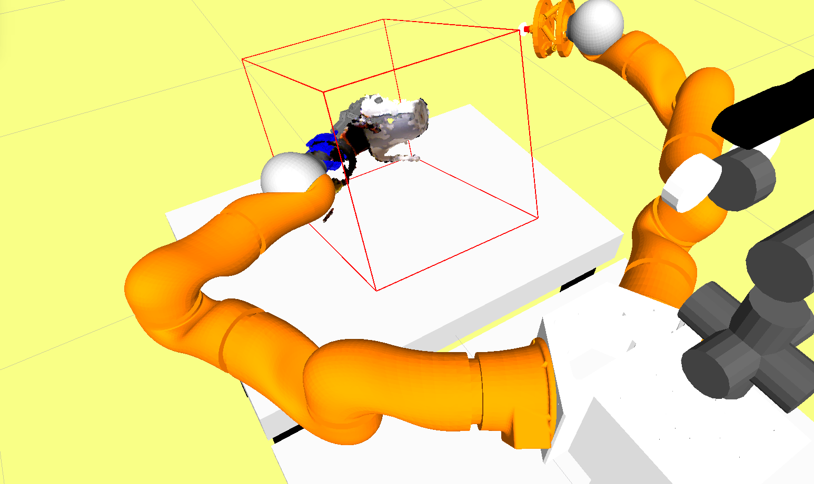
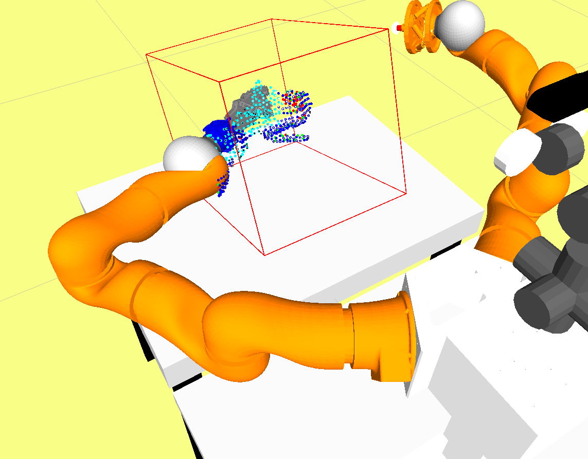
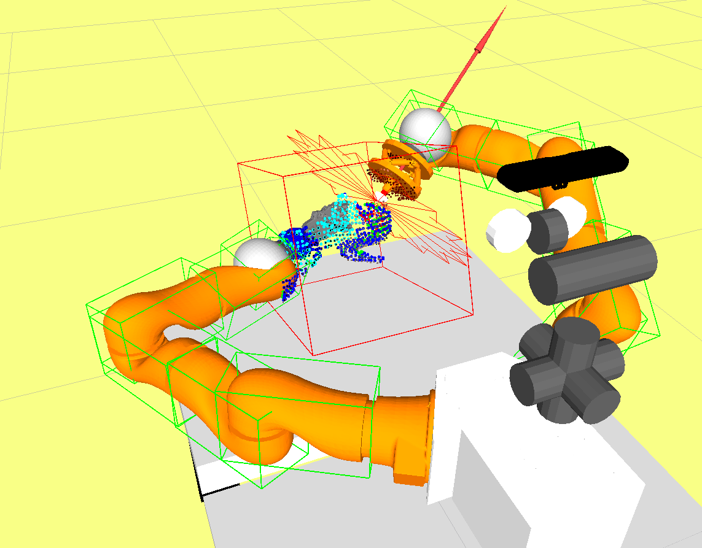

# PaCMan-DR54

__(AKA Tactile Exploration Demo)__

1. In-hand segmentation    |  2. Gaussian process modelling  | 3. Tactile exploration      |
:-------------------------:|:-------------------------------:|:----------------------------:
  |       |   |

## Development status

[RoadMap](https://github.com/carlosjoserg/pacman-DR54/milestones) -  

## Team members

  * Carlos Rosales ([@carlosjoserg](https://github.com/carlosjoserg))
  * Claudio Zito ([@memnone](https://github.com/memnone))
  * Edoardo Farnioli ([@edoardofarnioli](https://github.com/edoardofarnioli))
  * Federico Spinelli ([@Tabjones](https://github.com/Tabjones))
  * Gaspare Santaera ([@GaspareSantaera](https://github.com/GaspareSantaera))
  * Maxime Adjigble ([@maximeadjigble](https://github.com/maximeadjigble))
  * Marco Gabiccini [@marcogabiccini](https://github.com/marcogabiccini))
  * Jeremy L. Wyatt ([@jeremylwyatt](https://github.com/jeremylwyatt))

## Software

Clone recursively with:

`git clone --recursive https://github.com/carlosjoserg/pacman-DR54.git` 

Compile with:

`roscd && cd .. && catkin_make`

## Hardware

  - Pisa/IIT SoftHand (right)
  - F/T sensor ATI nano 17
  - Boris/Vito robot
  - RGBD Asus camera
  - Either Stewart/DLRFFH equipped with proper fingertips
